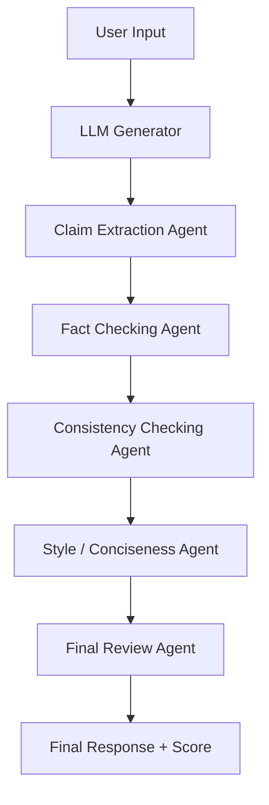

# LLM Denoising System — Multi-Agent Pipeline

A structured Python project for improving LLM outputs through extraction, verification, consistency checking, style improvement, and final review.

---

## Table of Contents

- [Architecture](#architecture)
- [Workflow](#workflow)
- [Project Structure](#project-structure)
- [Agents](#agents)
- [Input / Output](#input--output)
- [Installation](#installation)
- [Usage](#usage)
- [Notes](#notes)

---

## Architecture

This project is organized as a linear, modular pipeline. Each component has a clear responsibility, and data flows from input to final reviewed output.

### Core architecture components

- `utils/llm.py`: Adapter for the language model provider
- `pipeline.py`: Orchestrates the pipeline and passes data between agents
- `agents/`: Contains modular agent classes that inspect and improve the response
- `evaluation/metrics.py`: Computes quality scores and metrics
- `main.py` / `app.py`: Primary entrypoints to run the system

---

## Workflow

The workflow is designed to keep responsibilities separate and make the pipeline easy to extend.

1. **User Input**: Receive a user prompt or question.
2. **LLM Generator**: Generate the initial answer.
3. **Claim Extraction Agent**: Extract factual claims from the LLM output.
4. **Fact Checking Agent**: Verify those claims.
5. **Consistency Checking Agent**: Detect contradictions or mismatch.
6. **Style / Conciseness Agent**: Improve readability and tone.
7. **Final Review Agent**: Consolidate the final response and scoring.

### Workflow diagram



---

## Project Structure

```text
llm-denoising-system/
+-- agents/
¦   +-- conciseness_agent.py
¦   +-- consistency_agent.py
¦   +-- fact_checking_agent.py
¦   +-- final_review_agent.py
¦   +-- issue_extraction_agent.py
¦   +-- style_agent.py
+-- evaluation/
¦   +-- metrics.py
+-- utils/
¦   +-- llm.py
¦   +-- logger.py
+-- app.py
+-- main.py
+-- pipeline.py
+-- requirements.txt
+-- test_groq.py
+-- workflow.drawio
+-- README.md
```

### File responsibilities

- `app.py`: Optional application entrypoint.
- `main.py`: Main runner for the pipeline.
- `pipeline.py`: Connects the LLM output to each agent.
- `requirements.txt`: Python dependencies.
- `test_groq.py`: Example or validation test.
- `workflow.drawio`: Draw.io workflow diagram.
- `agents/`: Modular agent implementations.
- `utils/`: LLM and logging utilities.
- `evaluation/metrics.py`: Scoring and metrics.

---

## Agents

Each agent performs one focused step in the denoising pipeline:

- **Claim Extraction Agent**: identifies factual claims from the LLM response.
- **Fact Checking Agent**: assesses factual correctness.
- **Consistency Checking Agent**: verifies internal agreement.
- **Style Agent**: refines wording, tone, and readability.
- **Final Review Agent**: creates the final response and quality score.

---

## Input / Output

### Input

- Natural language prompt or question from the user.

Example:

```text
Where is the Eiffel Tower located?
```

### Output

- Verified, fact-checked answer
- Consistency-checked response
- Stylistic improvements
- Final quality score

---

## Installation

1. Clone the repository

```bash
git clone https://github.com/nandana-rnair/llm-denoising-system.git
cd llm-denoising-system
```

2. Create a virtual environment

```bash
python -m venv venv
venv\Scripts\activate
```

3. Install dependencies

```bash
pip install -r requirements.txt
```

4. Create `.env`

```text
GROQ_API_KEY=your_api_key_here
```

---

## Usage

Run the project with:

```bash
python main.py
```

Or run the app entrypoint with:

```bash
python app.py
```

---

## Notes

- Open `workflow.drawio` in draw.io / diagrams.net for the full visual workflow.
- Keep agent logic isolated for easier extension.
- Use `utils/llm.py` as the central location for changing the LLM provider.

---

## Author

Nandana R Nair
